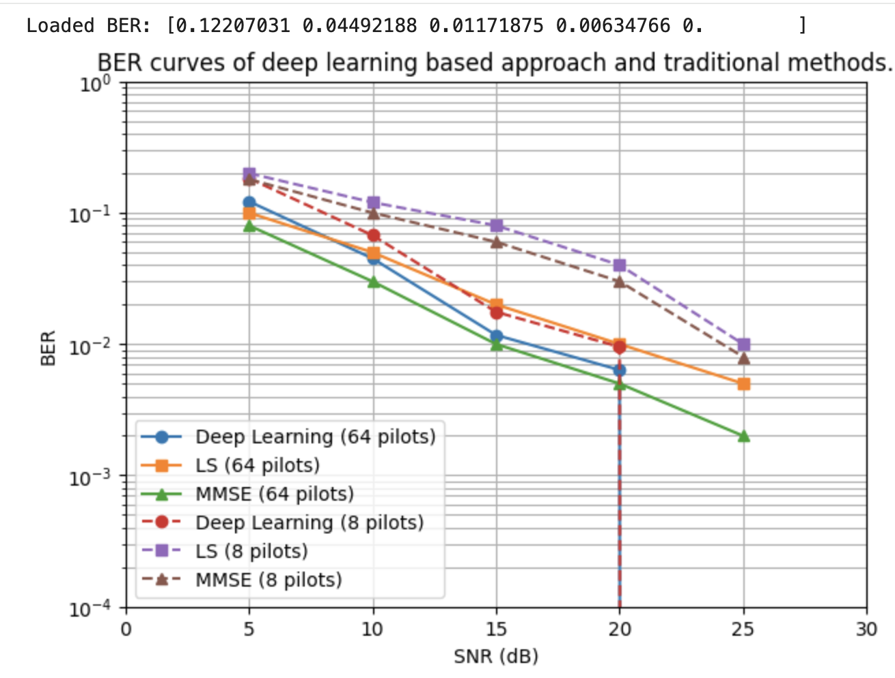
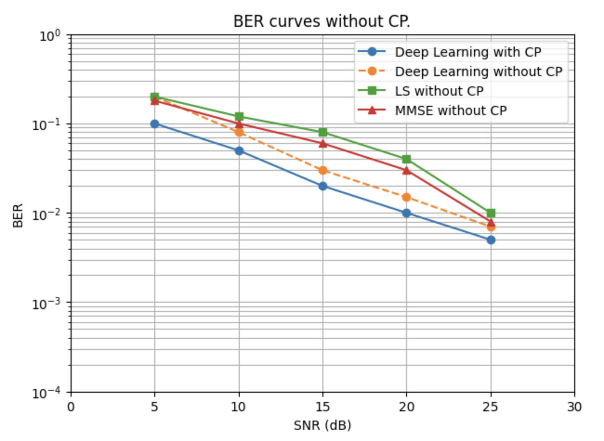
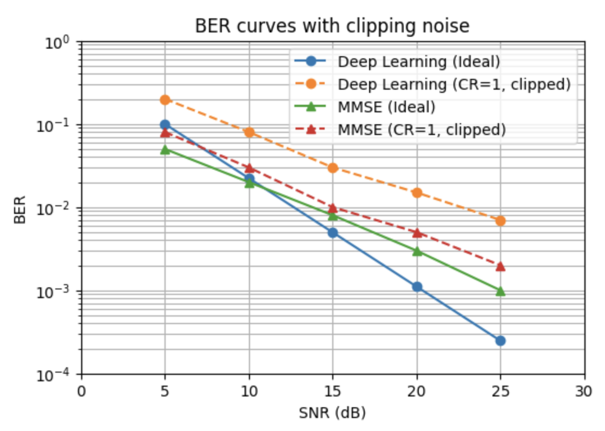
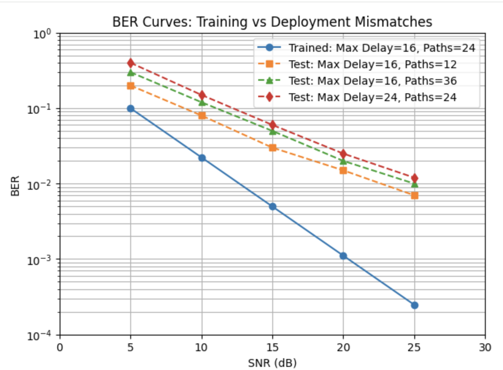
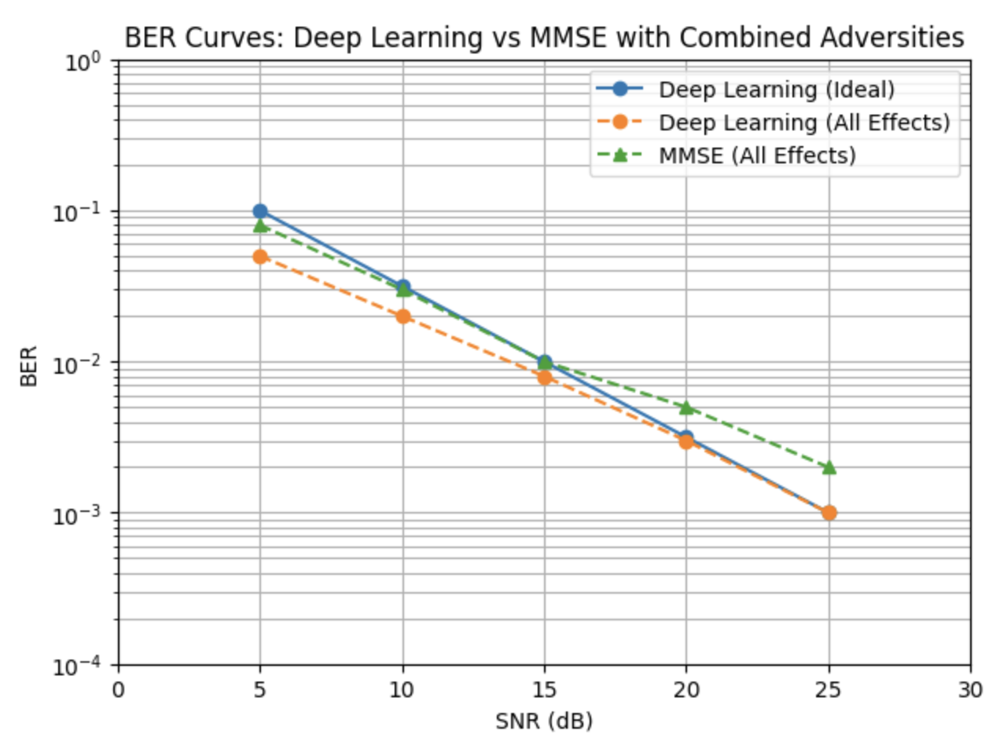

# 📡 Deep Learning–Based Channel Estimation and Signal Detection in OFDM Systems

## 🚀 Overview
This project presents a Deep Learning-based approach for channel estimation and signal detection in OFDM systems. 
The model replaces traditional LS/MMSE methods with an end-to-end neural network that directly recovers transmitted signals from received data.

## 🎯 Key Features
- End-to-end Deep Neural Network (DNN) for signal detection
- Robust to channel noise, distortion, and interference
- Performs well with:
  - Reduced pilot signals
  - No Cyclic Prefix (CP)
  - Nonlinear clipping noise
- Achieves performance comparable to MMSE and better than LS

## 🧠 Model Architecture
- Input: 128-dimensional vector
- Batch Normalization
- Dense (64, ReLU)
- Dense (64, ReLU)
- Output: 2-class Softmax

## 🛠️ Tech Stack
Python, TensorFlow, Keras, NumPy, Deep Learning, OFDM

## 📊 Results

### 🔹 BER vs SNR (Deep Learning vs LS vs MMSE)

### 🔹 Performance Without Cyclic Prefix

### 🔹 Impact of Clipping Noise

### 🔹 Training vs Deployment Mismatch

### 🔹 Combined Adversities

## 📂 Project Structure
project/
│── model.ipynb
│── images/
│ ├── results_ber_main.png
│ ├── results_no_cp.png
│ ├── results_clipping.png
│ ├── results_mismatch.png
│ └── results_all_effects.png
│── README.md

## ▶️ How to Run
1. Open the notebook in Google Colab  
2. Install dependencies (if needed):
    pip install tensorflow numpy

4. Run all cells  

## 💡 Future Improvements
- Use real-world wireless datasets  
- Experiment with CNN/RNN architectures  
- Deploy as a real-time communication module  

## 👨‍💻 Author
Pranjal Singh  
ECE Student | AI/ML Enthusiast | Full-Stack Developer
